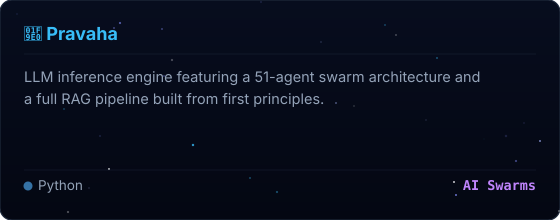
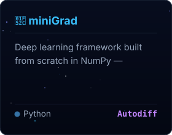
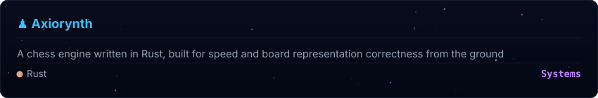

<!-- COCKPIT SPACE DASHBOARD - UNIFIED GRID (SPACIOUS LAYOUT) -->

  

<!-- Elevated Tech Arsenal section under the Hero Banner -->

  

    
  

  

    
  

  
Orchestrating production-grade tools across the cosmic software stack

  

  
  

  

 

---

 

## 🔴 Currently Building — *live from GitHub*

<!--START_SECTION:currently-building-->

&nbsp;&nbsp;

<!--END_SECTION:currently-building-->

 

---

## ✦ Flagship Projects

&nbsp;&nbsp;

 

---

## ✦ Connect & Collaborate

 

  ✨ "Writing code that feels like magic." ✨
   
  Last synced: 2026-08-06

