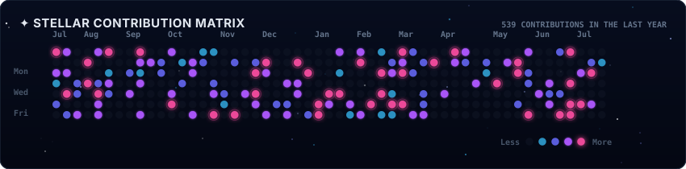
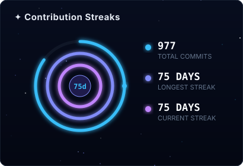
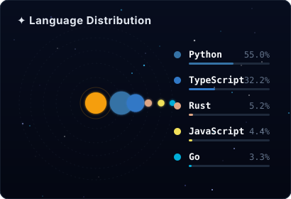
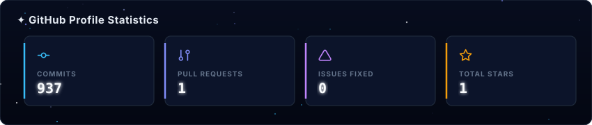

<!-- COCKPIT SPACE DASHBOARD - UNIFIED GRID (SPACIOUS LAYOUT) -->

  

  

  

  
  

  

 

---

 

## 🔴 Currently Building — *live from GitHub*

<!--START_SECTION:currently-building-->

  <h3 style="margin: 0 0 6px 0; font-size: 16px;">
    <a href="https://github.com/Eternalcodertanishq3/Semantic-6G" style="text-decoration: none; color: #38BDF8; font-weight: bold;">🌐 Semantic-6G</a>
  </h3>
  
Software-based 6G semantic communication system using ResNet + GRU autoencoders.

  

    <strong>Last Commit:</strong> refactor: optimize PyTorch image encoders
  

  

    
      
      Python
    
    ⏱ 18d ago
    ★ 0
  

  <h3 style="margin: 0 0 6px 0; font-size: 16px;">
    <a href="https://github.com/Eternalcodertanishq3/Larder" style="text-decoration: none; color: #38BDF8; font-weight: bold;">🌐 Larder</a>
  </h3>
  
Production-grade multi-tenant restaurant SaaS inventory & OCR invoice parser.

  

    <strong>Last Commit:</strong> feat: integrate tesseract OCR parser
  

  

    
      
      TypeScript
    
    ⏱ in progress
    ★ 0
  

  <h3 style="margin: 0 0 6px 0; font-size: 16px;">
    <a href="https://github.com/Eternalcodertanishq3/ShipGate" style="text-decoration: none; color: #38BDF8; font-weight: bold;">🌐 ShipGate</a>
  </h3>
  
Self-serve production-readiness scorer for AI-agent-built apps.

  

    <strong>Last Commit:</strong> feat: parse repo dependencies on load
  

  

    
      
      TypeScript
    
    ⏱ building
    ★ 0
  

🔄 Auto-synced from live GitHub activity — updates every 6 hours
<!--END_SECTION:currently-building-->

 

---

## ✦ Flagship Projects

  <h3 style="margin: 0 0 6px 0; font-size: 16px;">
    <a href="https://github.com/Eternalcodertanishq3/Pravaha" style="text-decoration: none; color: #818CF8; font-weight: bold;">🧠 Pravaha</a>
  </h3>
  
LLM inference engine featuring a 51-agent swarm architecture and a full RAG pipeline built from first principles.

  

    Python
    AI Swarms
  

  <h3 style="margin: 0 0 6px 0; font-size: 16px;">
    <a href="https://github.com/Eternalcodertanishq3/miniGrad" style="text-decoration: none; color: #818CF8; font-weight: bold;">🔬 miniGrad</a>
  </h3>
  
Deep learning framework built from scratch in NumPy — gradients verified against PyTorch to 1e-6. Published to PyPI.

  

    Python
    Autodiff
  

  <h3 style="margin: 0 0 6px 0; font-size: 16px;">
    <a href="https://github.com/Eternalcodertanishq3/Axiorynth" style="text-decoration: none; color: #818CF8; font-weight: bold;">♟️ Axiorynth</a>
  </h3>
  
A chess engine written in Rust, built for speed and board representation correctness from the ground up.

  

    Rust
    Systems
  

 

---

## 🦾 Tech Arsenal

  

    
  

  

    
  

  
Orchestrating production-grade tools across the cosmic software stack

 

---

## ⚡ Live Contribution Heatmap

  <picture>
    <source media="(prefers-color-scheme: dark)" srcset="https://raw.githubusercontent.com/Eternalcodertanishq3/Eternalcodertanishq3/output/github-contribution-grid-snake-dark.svg">
    
  </picture>
  ⚡ Contribution snake generated every 12 hours

 

---

## ✦ Connect & Collaborate

 

  ✨ "Writing code that feels like magic." ✨
   
  Last synced: 2026-07-21

