  

  

    

  
  
  
  
   
  
  
  

## ✦ About Me

I'm **Tanishq Mangal** — a computer science engineer who builds at the intersection of **full-stack development**, **applied AI/ML**, and **systems programming**. A recent CS grad, currently building ambitious, production-grade software and actively looking for full-time engineering roles.

I care about products that are fast, correct, and don't look like everyone else's — premium interfaces backed by real engineering, not just a nice coat of paint.

 

## 🔴 Currently Building — *live from GitHub*

<!--START_SECTION:currently-building-->
<table>
<tr><th>Repository</th><th>Language</th><th>Stars</th><th>Latest Commit</th></tr>
<tr>
<td width="230"><a href="https://github.com/Eternalcodertanishq3/Semantic-6G"><b>Semantic-6G</b></a> Software-based 6G semantic communication system using Joint Source-Channel Coding — ResNet image + GRU text autoencoders.</td>
<td align="center"><b>Python</b></td>
<td align="center">★ —</td>
<td>Task-aware auxiliary loss + fading channel stress tests ⏱ recent</td>
</tr>
<tr>
<td width="230"><b>Larder</b> Production-grade multi-tenant restaurant SaaS — inventory, suppliers, invoice OCR, staff scheduling, prime cost dashboard.</td>
<td align="center"><b>TypeScript</b></td>
<td align="center">★ —</td>
<td>Master prompt suite in progress ⏱ recent</td>
</tr>
<tr>
<td width="230"><b>ShipGate</b> Self-serve production-readiness scorer for AI-agent-built apps — scans repos, generates agent-specific remediation prompts.</td>
<td align="center"><b>TypeScript</b></td>
<td align="center">★ —</td>
<td>Spec validated, build in progress ⏱ recent</td>
</tr>
</table>

⚠️ Static seed data — replaced automatically on first Action run. See setup step 4.
<!--END_SECTION:currently-building-->

🔄 This table re-syncs itself every 6 hours straight from my push activity — no manual edits needed. Powered by <code>.github/workflows/sync-readme.yml</code>.

## ⭐ Flagship Projects

<table>
<tr>
<td width="50%" valign="top">

**🧠 [Pravaha](https://github.com/Eternalcodertanishq3/Pravaha)**
 LLM inference engine with a 51-agent swarm architecture and a full RAG pipeline built from first principles.
 Python · LLM Inference · RAG

</td>
<td width="50%" valign="top">

**🔬 [miniGrad](https://github.com/Eternalcodertanishq3/miniGrad)**
 Deep learning framework built from scratch in NumPy — gradients verified against PyTorch to 1e-6. Published to PyPI.
 Python · Autodiff · PyPI Package

</td>
</tr>
<tr>
<td width="50%" valign="top">

**🔐 [Ghost Protocol](https://github.com/Eternalcodertanishq3/Ghost-Protocol)**
 Federated learning system secured with homomorphic encryption — privacy-preserving distributed training.
 Python · Federated Learning · Cryptography

</td>
<td width="50%" valign="top">

**♟️ [Axiorynth](https://github.com/Eternalcodertanishq3/Axiorynth)**
 A chess engine written in Rust, built for speed and correctness from the board representation up.
 Rust · Search · Evaluation

</td>
</tr>
<tr>
<td width="50%" valign="top">

**📡 [Semantic-6G](https://github.com/Eternalcodertanishq3/Semantic-6G)**
 Software-based 6G semantic communication system — Joint Source-Channel Coding with ResNet + GRU autoencoders.
 Python · PyTorch · Signal Processing

</td>
<td width="50%" valign="top">

**🏋️ [Advanced Gym Portal](https://github.com/Eternalcodertanishq3/Advanced-Gym-Portal)**
 Multi-tenant SaaS platform for gym management — the architectural blueprint behind my later SaaS builds.
 Full-Stack · Multi-Tenant · SaaS

</td>
</tr>
</table>

Two or three of these links are my best guess at the repo slug — swap in the exact URL if it differs.

## 🧠 Tech Arsenal

 

## 📊 Live Analytics

<picture>
  <source media="(prefers-color-scheme: dark)" srcset="https://github-readme-stats.vercel.app/api?username=Eternalcodertanishq3&show_icons=true&theme=tokyonight&hide_border=true&bg_color=0D1117&title_color=38BDF8&icon_color=38BDF8">
  
</picture>

  

  

  

  

 

 

<b>More about me</b>

 

- I like building products that feel **modern, fluid, and intentional**.
- I enjoy systems that pair **engineering rigor** with **visual craft**.
- I'm especially drawn to **AI systems**, **multilingual/semantic communication**, **real-time infrastructure**, and **premium UI engineering**.
- I care about code that's not just functional, but **elegant, scalable, and memorable**.
- Certified **AWS Cloud Practitioner** and **Postman Student Expert**.

## ✦ Connect

"Writing code that feels like magic."

