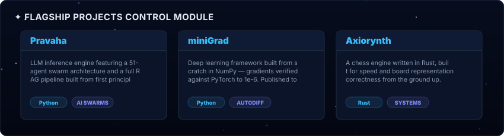

<!-- COCKPIT SPACE DASHBOARD - UNIFIED GRID (SPACIOUS LAYOUT) -->

  

  

  

  
  

  

  

  

  

  <!-- We reference the generated snake animation here -->
  <picture>
    <source media="(prefers-color-scheme: dark)" srcset="https://raw.githubusercontent.com/Eternalcodertanishq3/Eternalcodertanishq3/output/github-contribution-grid-snake-dark.svg">
    
  </picture>

  

 

  💫 Real-time instant updates enabled via Vercel Serverless Architecture.

